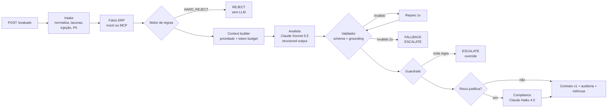

# Agente de Aprovação de Solicitações de Compra (LLM Engineering), versão Python

Case técnico Itaú, *Engenharia de Prompt, Contexto e Agentes*. Cenário 03: **aprovação de solicitações de compra**.

Um serviço Python/FastAPI que recebe solicitações de compra (inclusive incompletas, ruidosas ou maliciosas), enriquece com contexto (orçamento, fornecedor, histórico, políticas), consumido **direto ou via MCP**, e usa o **Claude** de forma controlada para produzir uma **decisão estruturada, explicável e auditável**: `APPROVE`, `REJECT`, `ESCALATE_TO_HUMAN` ou `NEEDS_INFO`, com cada justificativa ancorada em evidências e um payload pronto para o ERP.

> **Princípio central:** o LLM é um componente de julgamento dentro de um sistema determinístico, e não o dono da decisão. As regras rígidas rodam antes dele, um validador em código confere tudo o que ele diz, e qualquer falha termina em revisão humana (*fail-safe*).

> **Duas implementações, mesma solução.** Existe uma versão em Java/Spring Boot: [gbmeello/itau-llm-case](https://github.com/gbmeello/itau-llm-case). Esta versão em Python mantém arquitetura, contratos, prompts, políticas e golden set **idênticos**, e acrescenta o **servidor MCP** do ERP. Ver [ADR-0008](docs/adr/0008-python-vs-java.md).

## Sumário

| Documento | Conteúdo |
|---|---|
| [SPEC.md](SPEC.md) | Especificação aprovada (requisitos → solução) e desvios registrados |
| [AGENT.md](AGENT.md) | Documento formal do agente: papéis, contratos, exemplos, limitações, fallbacks |
| [docs/architecture.md](docs/architecture.md) | Diagramas (componentes, sequência, decisão) e fluxo |
| [docs/context-and-tokens.md](docs/context-and-tokens.md) | Engenharia de contexto, token budget e FinOps |
| [docs/observability.md](docs/observability.md) | Métricas, logs, traces e alertas |
| [docs/testing-strategy.md](docs/testing-strategy.md) | Estratégia de testes e evals (golden set, regressão) |
| [docs/adr/](docs/adr/) | Decisões técnicas e trade-offs (8 ADRs, incluindo MCP e Python vs Java) |
| [docs/limitations-and-evolution.md](docs/limitations-and-evolution.md) | Simplificações, limitações e evoluções |
| [docs/AI-USAGE.md](docs/AI-USAGE.md) | **Como e quando a IA foi usada na construção** |
| [docs/presentation.md](docs/presentation.md) | Roteiro da apresentação (30 min) |
| [CHANGELOG-SKILLS.md](CHANGELOG-SKILLS.md) | Criação, atualização e remoção de skills (prompts/políticas) |

## Como executar

**Pré-requisito:** Python 3.12+. Não é preciso chave de API: por padrão roda com um LLM simulado determinístico.

```bash
python -m venv .venv
source .venv/bin/activate            # Windows: .venv\Scripts\activate
pip install -e ".[dev]"

pytest                               # 42 testes: unitários + integração (LLM fake, inclusive pipeline via MCP)
pytest -m eval                       # golden set (34 casos / 37 turnos) contra o LLM fake
python -m purchase_agent             # API em http://127.0.0.1:8080 (docs interativas em /docs)
./scripts/demo.sh                    # 7 cenários + multi-turno + idempotência + métricas
./scripts/demo-skills.sh             # CRUD versionado de skills com rastreabilidade
./scripts/run-with-mcp.sh            # servidor MCP do ERP (:8001) + API consumindo o ERP via MCP
```

**Com o Claude real** (requer uma chave do [Console Anthropic](https://console.anthropic.com/settings/keys)):

```bash
export ANTHROPIC_API_KEY=sk-ant-...
LLM_PROVIDER=anthropic python -m purchase_agent     # claude-sonnet-5-5 (analista) + claude-haiku-4-5 (compliance)
LLM_PROVIDER=anthropic pytest -m eval               # golden set contra o modelo real (custo estimado < US$ 0,50)
```

| Variável | Default | Uso |
|---|---|---|
| `LLM_PROVIDER` | `fake` | `fake` ou `anthropic` |
| `ANTHROPIC_API_KEY` | — | Obrigatória com `anthropic` |
| `AGENT_API_KEY` | `dev-key-change-me` | Header `X-API-Key` exigido em `/v1/**` |
| `ERP_SOURCE` | `mock` | `mock` (in-process) ou `mcp` (servidor `erp-mcp`) |
| `MCP_ERP_URL` | `http://127.0.0.1:8001/mcp` | Endpoint Streamable HTTP do servidor MCP |
| `AGENT_FIXED_DATE` | `2026-10-06` | "Hoje" das regras de negócio (os dados sintéticos são de 2026); `none` = relógio real |
| `DATABASE_URL` | SQLite em memória | Ex.: `postgresql+psycopg://...` |
| `LOG_FORMAT` | `json` | `json` ou `text` |

## API

| Método | Rota | Descrição |
|---|---|---|
| `POST` | `/v1/purchase-requests/evaluate` | Avalia uma solicitação → `PurchaseDecision` (idempotente por conteúdo) |
| `POST` | `/v1/cases/{caseId}/messages` | Nova rodada de um caso `NEEDS_INFO` (`message` + `updates`) |
| `GET` | `/v1/cases/{caseId}` | Estado do caso (rodada, resumo incremental) |
| `GET` | `/v1/decisions/{decisionId}` | Auditoria: decisão, contexto incluído/excluído, versões, custo |
| `GET` | `/v1/decisions?requestId=` | Histórico de decisões de uma solicitação |
| `GET/POST/DELETE` | `/v1/skills[/{id}[/versions[/{v}/activate]]]` | CRUD versionado de skills |
| `GET` | `/metrics` | Métricas Prometheus (latência, tokens, custo, erros, fallbacks, guardrails) |
| `GET` | `/health`, `/docs` | Saúde e OpenAPI |

**Servidor MCP `erp-mcp`** (`python -m purchase_agent.mcp_server.erp_server`): ferramentas `get_cost_center_budget`, `get_supplier_profile` e `get_purchase_history`. Pode ser usado por este agente (`ERP_SOURCE=mcp`) ou por qualquer cliente MCP (ex.: Claude Desktop/Code via `--stdio`).

Contratos: [`purchase-request.v1.json`](src/purchase_agent/resources/schemas/purchase-request.v1.json) → [`purchase-decision.v1.json`](src/purchase_agent/resources/schemas/purchase-decision.v1.json). Exemplos em [`examples/`](examples/); respostas reais em [`examples/responses/`](examples/responses/).

## Arquitetura em uma imagem



## Resultados

| Verificação | Resultado |
|---|---|
| `pytest` | **42 testes ✅** (intake, regras, contexto, validador, resiliência/circuit breaker, MCP, API, casos, skills, métricas, pipeline completo via MCP) |
| `pytest -m eval` | **37 turnos / 34 casos**: acurácia 100%, schema 100%, grounding 100%, 0 decisões proibidas, adversariais 100% ([relatório](evals/reports/latest-fake.md)); mesmo resultado da versão Java |
| Demo real | API + servidor MCP em processos separados (`scripts/run-with-mcp.sh`), 7 cenários, multi-turno, idempotência, CRUD de skills |
| `LLM_PROVIDER=anthropic pytest -m eval` | **Não executado até a entrega** (sem chave de API). O runner está pronto |

> O eval com o LLM fake prova que **o sistema em volta do modelo** funciona: contratos, grounding, guardrails, fallbacks, multi-turno, MCP e custos. Ele **não** mede a qualidade de julgamento do Claude. Essa medida vem do eval com o modelo real, e o primeiro passo depois de obter a chave é rodá-lo e salvar o baseline (`EVAL_UPDATE_BASELINE=true`).

## Estrutura

```
src/purchase_agent/
  contract/   modelos Pydantic + validação JSON Schema    intake/    normalização, CNPJ, detector de injeção
  policy/     motor de regras determinístico             context/   ERP (mock/MCP), fatos, context builder, budget
  llm/        cliente Anthropic, fake, resiliência        agent/     orquestrador, prompts, validador, montagem
  registry/   skills versionadas (CRUD)                   audit/     registro de decisões
  api/        FastAPI (borda, rotas, casos)               observability/ métricas Prometheus, logs JSON
  mcp_server/ servidor MCP do ERP                         resources/ schemas, skills, dados sintéticos
tests/        unitários, integração, golden set           evals/     golden set, relatórios, baseline
docs/         arquitetura, ADRs, uso de IA, apresentação
```
