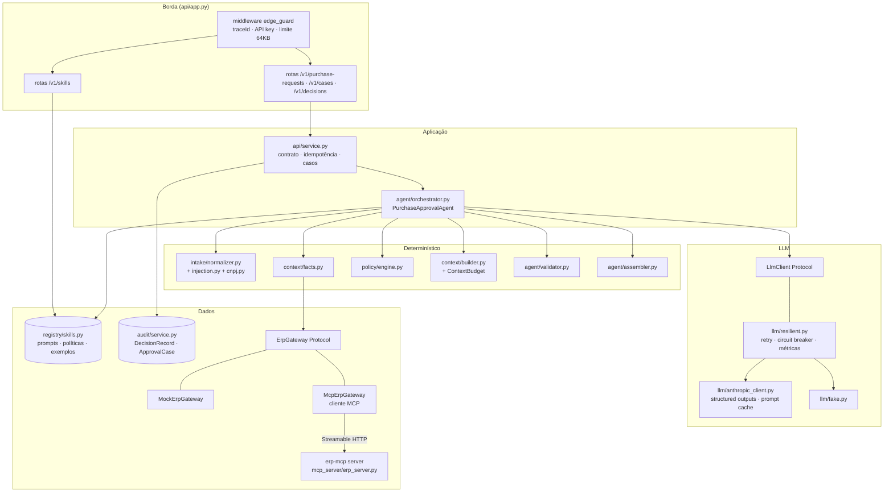
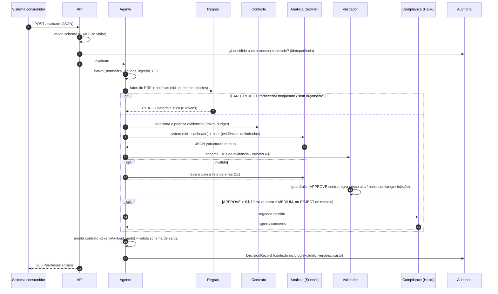
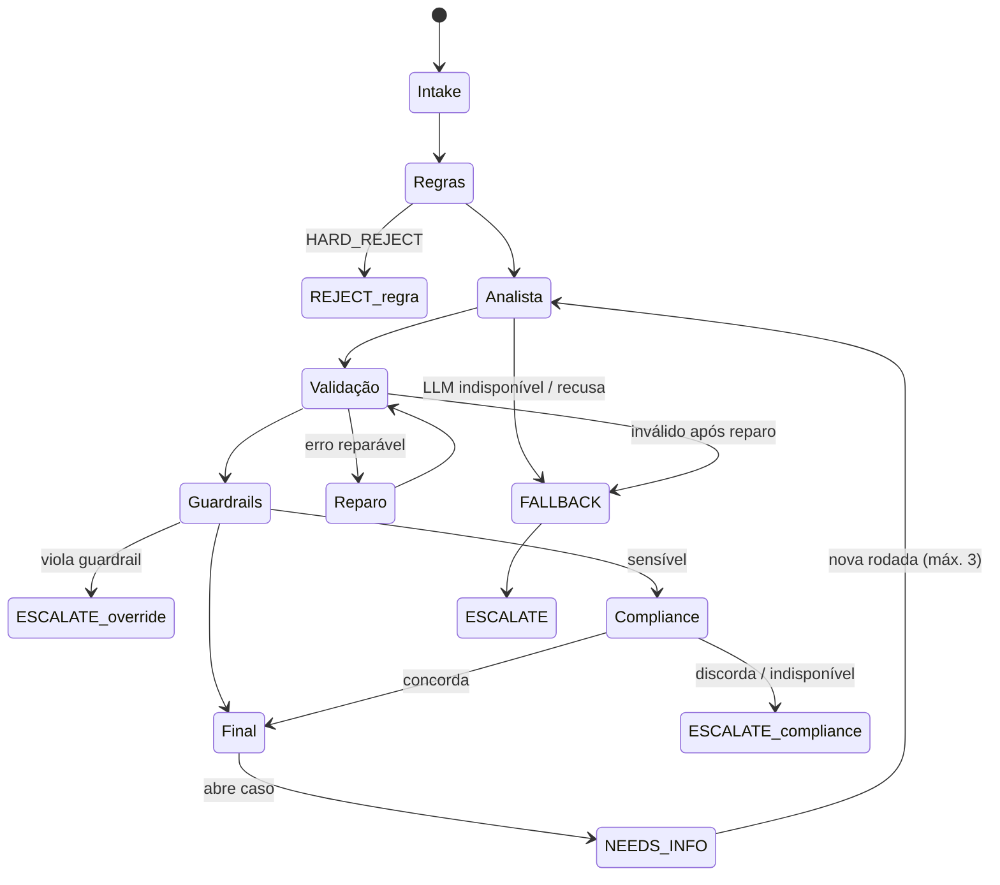

# Arquitetura

## 1. Visão de componentes

**Por que um monólito modular:** o escopo é de dias, e as fronteiras entre pacotes (`contract`, `intake`, `policy`, `context`, `llm`, `agent`, `registry`, `audit`, `mcp_server`) já permitem extrair serviços depois. A dependência é sempre na direção do núcleo determinístico, e o LLM fica atrás de uma interface ([ADR-0001](adr/0001-llm-como-componente-controlado.md)).

## 2. Sequência de uma avaliação

## 3. Máquina de decisão

## 4. Multi-turno (casos `NEEDS_INFO`)

- A decisão `NEEDS_INFO` cria um `caseId`. O solicitante responde via `POST /v1/cases/{caseId}/messages` com `message` (texto livre) e `updates` (campos estruturados, mesclados no request original).
- **Coerência sem crescimento de contexto:** a resposta do solicitante é anexada à justificativa (continua em `<untrusted_input>` e passa pelo detector de injeção). O histórico de rodadas **não** é reenviado: o `case-summarizer` (Haiku) produz um resumo incremental com teto (~80 palavras, 600 caracteres), que entra como `EV-CASE` (camada P3, ≤ 300 tokens).
- No máximo 3 rodadas; depois disso, `ESCALATE_TO_HUMAN` com o evento `CASE_ROUNDS_EXHAUSTED`. Se o sumarizador falhar, usa-se um resumo determinístico truncado.

## 5. Decisões técnicas

| Tema | Decisão | ADR |
|---|---|---|
| Papel do LLM | Componente controlado; regras rígidas fora dele | [0001](adr/0001-llm-como-componente-controlado.md) |
| Contrato de saída | Structured outputs + JSON Schema + validação em código | [0002](adr/0002-structured-outputs-e-validacao.md) |
| Contexto | Pré-busca determinística em vez de tool calling autônomo | [0003](adr/0003-contexto-pre-buscado-vs-tool-calling.md) |
| Multi-agente | Analista (Sonnet) + validador (código) + compliance (Haiku) | [0004](adr/0004-multi-agente-e-modelos.md) |
| Skills | Registry versionado, imutável, soft delete | [0005](adr/0005-registry-de-skills.md) |
| MCP | Servidor `erp-mcp` + `McpErpGateway` (ERP_SOURCE=mcp) |  [0006](adr/0006-mcp.md) |
| Testes de LLM | Fake determinístico + golden set + eval real com gate | [0007](adr/0007-fake-llm-e-evals.md) |
| Linguagem | Python (port da versão Java) | [0008](adr/0008-python-vs-java.md) |
